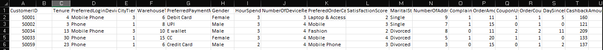
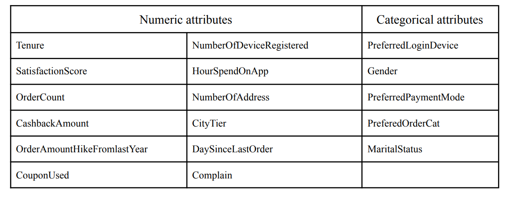
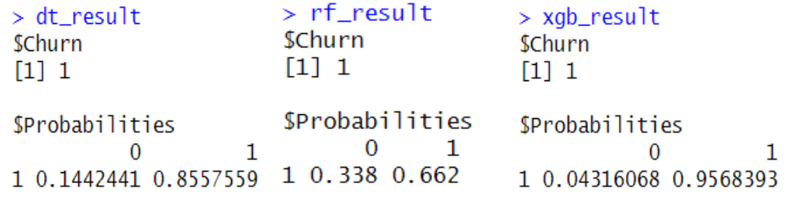
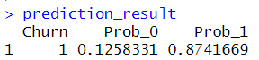
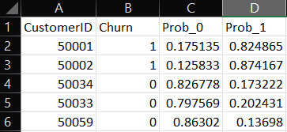
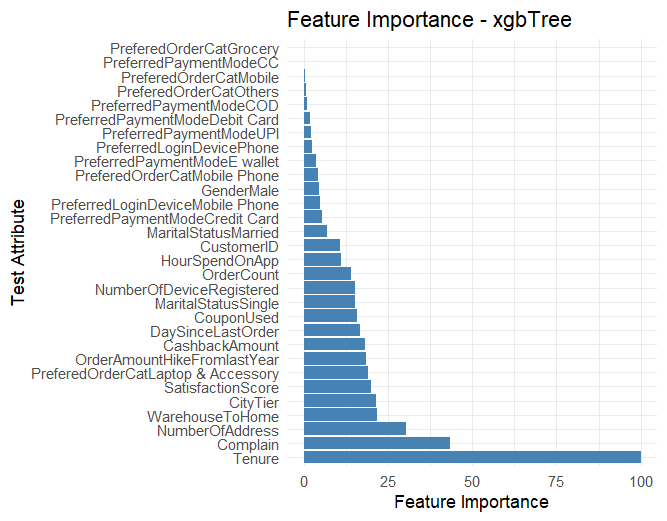
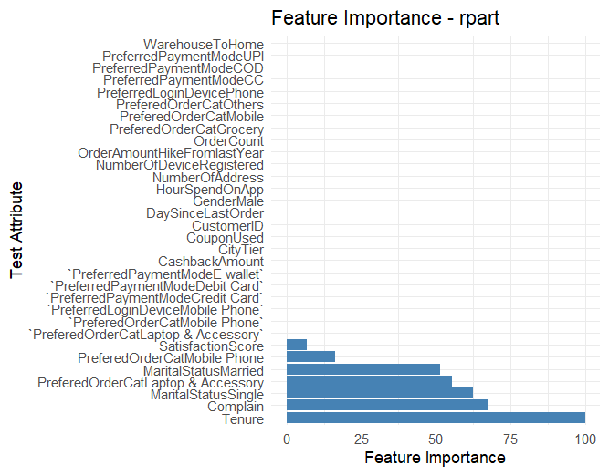
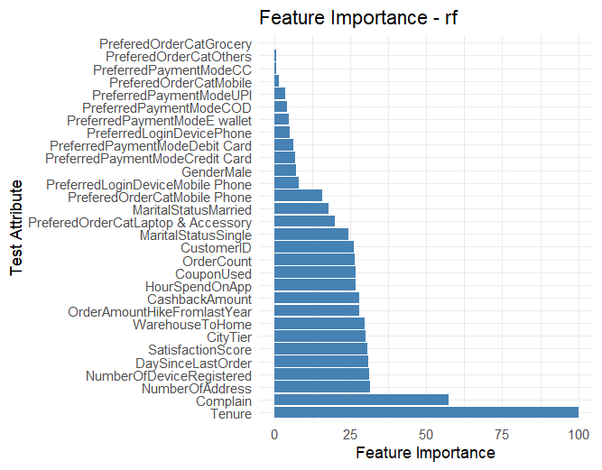

# Customer Churn Analysis App

## How to Run  
- Run app.py: `python app.py`  
- Access localhost: [http://127.0.0.1:5000/](http://127.0.0.1:5000/)  

## Input  
- Upload a CSV file → refer `/static` for sample data  

## Output  
- Download processed CSV file → refer `/data/output.csv` for sample output

## Documentation  

### Objective  
Develop an accurate churn prediction system that helps businesses retain customers by leveraging data-driven insights to enhance decision-making and engagement strategies.  

### Implementation Outline  
The framework follows a modular pipeline:  

1. **Data Preprocessing** – Handle missing values, encode categorical variables, and balance data using ROSE.  
2. **Model Training** – Train Decision Tree, Random Forest, and XGBoost models.  
3. **Prediction & API Integration** – Process input CSV files, apply trained models, and aggregate predictions using majority voting and weighted averages.  
4. **Frontend & Output** – Serve predictions via a Plumber API, integrated into a Flask-based UI, with downloadable results in CSV format.  

### Dataset  
- **Source:** Kaggle (Refer `/data/training_dataset.csv`)  
- **Preprocessing Steps:**  
  - Train-test split: 80:20 ratio  
  - Remove rows with null values  
  - Encode categorical attributes for uniform analysis

### Prediction of Churn

1. **Sample Input file**
  

2. **Attributes**
  

3. **Data Pre-Processing**
   - Rows containing null values are dropped. Users may be intimated at frontend.
   - Categorical attributes are represented as their atomic equivalents. E.g., attribute Marital Status can be either Married or Single. So it is converted into atomic factors: MaritalStatus<Single/Married>.

4. **Individual model results**
  

5. **Aggregated Prediction Result**
  

6. **Sample Output file**
  

## Performance Analysis

#### Metrics for Evaluation  

- **Accuracy**: Measures the proportion of correctly predicted instances. Higher accuracy indicates better model performance.  
- **Recall**: Evaluates the model’s ability to detect relevant cases. A high recall reduces false negatives, crucial in churn prediction to avoid missing actual churners.  
- **Jaccard Index**: Assesses the overlap between predicted churners and actual churners. Higher values indicate better model performance in distinguishing churners from non-churners.  
- **F1 Score**: Combines precision and recall to provide a balanced metric. A high F1 score indicates the model minimizes both false positives and false negatives, especially in imbalanced datasets.  

#### Understanding Confusion matrix

#### Peformance Metrics of trained models

#### Feature Importance Trends
- **Decision Tree**: Highlights key attributes for churn prediction.  
- **Random Forest**: Offers a more balanced view by averaging across multiple trees.  
- **XGBoost**: Identifies features with strong predictive power, often capturing non-linear patterns. Comparing these models helps pinpoint the most influential factors driving churn.  

1. **XGBoost Model**
     
2. **Decision Tree**
     
3. **Random Forest**
     

## Limitations  
- **Dependence on Data Quality**: Model accuracy is affected by the quality and completeness of input data.  
- **Limited Interpretability**: While churn probabilities are predicted, the reasons behind a customer's likelihood to churn may not be fully explained.  
- **Potential Bias**: Imbalanced or non-diverse training data can lead to biased predictions.  
- **Computational Cost**: Complex features and large datasets may require significant resources.  

## Overview  
The churn analysis system helps businesses predict customer attrition and improve retention strategies. Future work may focus on enhancing model interpretability, integrating advanced algorithms, and optimizing data preprocessing for better accuracy and efficiency.  

